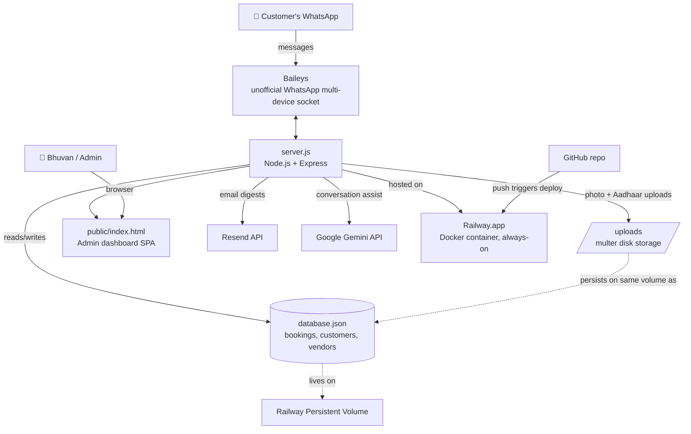

# FixMaadi — Technical Architecture

## System Map

## Tech Stack

| Layer | Tool | Purpose |
|---|---|---|
| Runtime | Node.js 20 | Server runtime |
| WhatsApp | `@whiskeysockets/baileys` | Unofficial multi-device WhatsApp Web socket — no Meta Business API, no per-message cost |
| Web server | Express | Serves the admin dashboard + JSON API |
| File uploads | `multer` | Provider photo + Aadhaar image intake |
| Email | Resend API | Operational email digests (optional — degrades gracefully if unset) |
| AI | Google Gemini API | Conversation assist (optional — degrades gracefully if unset) |
| Persistence | `database.json` (flat file) | Bookings, customers, vendors, attendance — no database server |
| Hosting | Railway.app | Docker deploy, auto-deploy on push to `main`, persistent Volume for data survival |
| Frontend | Vanilla HTML/CSS/JS | No build step — `public/index.html` is the entire admin dashboard |

## Data Flow: A Booking, End to End

1. Customer messages the WhatsApp number → Baileys receives it → `server.js` runs the conversation state machine (`userStates` in memory, persisted to `database.json` on every step).
2. Name → Service → Calling number confirm → Address/time → optional map pin → booking created (`bookings` array).
3. Admin opens the dashboard, assigns a technician → customer gets the technician's photo + Start OTP over WhatsApp.
4. Technician arrives, customer reads out the Start OTP, admin enters it → work timer starts.
5. Job done, End OTP entered → WhatsApp sends a completion message + feedback survey → customer replies 1-5 → rating recorded against the provider.

## Why no traditional database?

The whole system runs on a single flat JSON file (`database.json`) written to a Railway persistent Volume. This is a deliberate simplicity trade-off for the current scale (a single-city, single-instance operation) — it's the entire reason `saveDatabaseToDisk()` is called after every state mutation. If booking volume grows enough that this becomes a bottleneck, the natural next step is Postgres (Railway offers this natively) with the same `bookings`/`customerDatabase`/`vendors` shapes carried over as table schemas.

## Known architectural constraints

- **Single WhatsApp connection only.** Baileys allows exactly one active session per linked device. The code explicitly refuses to run the socket in more than one place at a time (`DISABLE_WHATSAPP_SOCKET` / `RENDER` env checks) to avoid WhatsApp terminating the session with a conflict error.
- **No authentication on the admin dashboard.** Anyone with the URL can currently see bookings, customer phone numbers, and provider details. This is the top item worth addressing next as usage grows.
- **In-memory state (`userStates`) is not persisted with the same rigor as `bookings`.** A mid-conversation restart without volume persistence would lose an in-progress (not-yet-completed) chat, though completed bookings are safe.
