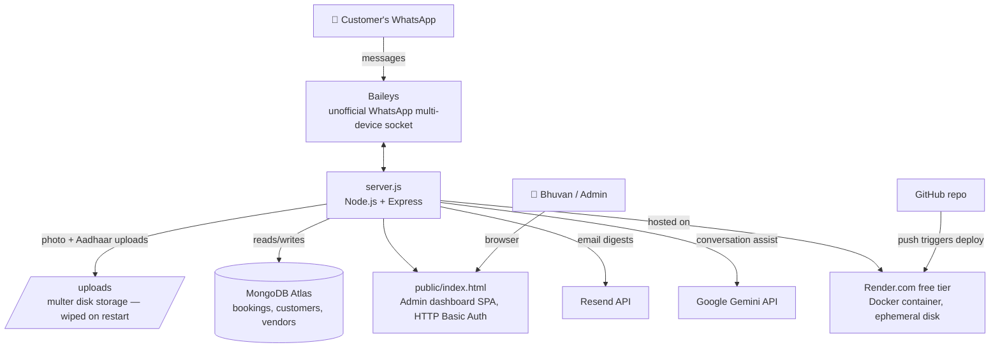

# FixMaadi — Technical Architecture

## System Map

## Tech Stack

| Layer | Tool | Purpose |
|---|---|---|
| Runtime | Node.js 20 | Server runtime |
| WhatsApp | `@whiskeysockets/baileys` | Unofficial multi-device WhatsApp Web socket — no Meta Business API, no per-message cost |
| Web server | Express | Serves the admin dashboard + JSON API |
| File uploads | `multer` | Provider photo + Aadhaar image intake |
| Email | Resend API | Operational email digests (optional — degrades gracefully if unset) |
| AI | Google Gemini API | Conversation assist (optional — degrades gracefully if unset) |
| Persistence | MongoDB Atlas (free M0 tier) | Bookings, customers, vendors, attendance — one document, no schema migrations needed. Falls back to a local `database.json` file when `MONGODB_URI` isn't set (local dev only). |
| Hosting | Render.com (free tier) | Docker deploy, auto-deploy on push to `main`. No persistent disk — see "Known architectural constraints" below. |
| Frontend | Vanilla HTML/CSS/JS | No build step — `public/index.html` is the entire admin dashboard |

## Data Flow: A Booking, End to End

1. Customer messages the WhatsApp number → Baileys receives it → `server.js` runs the conversation state machine (`userStates` in memory, persisted to `database.json` on every step).
2. Name → Service → Calling number confirm → Address/time → optional map pin → booking created (`bookings` array).
3. Admin opens the dashboard, assigns a technician → customer gets the technician's photo + Start OTP over WhatsApp.
4. Technician arrives, customer reads out the Start OTP, admin enters it → work timer starts.
5. Job done, End OTP entered → WhatsApp sends a completion message + feedback survey → customer replies 1-5 → rating recorded against the provider.

## Why a single-document database?

The whole system's state (`bookings`, `customerDatabase`, `vendors`, `attendance`, etc.) is stored as one JSON-shaped document, loaded into memory at startup and written back after every mutation via `saveDatabaseToDisk()` — it's a flat-file mental model, just backed by MongoDB Atlas instead of a local file. This was a deliberate move: Render's free tier (unlike Railway's, which this ran on originally) has no persistent disk, so a local `database.json` would be wiped on every restart. MongoDB Atlas's free M0 tier survives restarts and costs nothing. If booking volume ever grows enough that a single document becomes a bottleneck, the natural next step is splitting into real MongoDB collections per entity (`bookings`, `vendors`, etc.) — the in-memory shapes already carry over directly.

## Known architectural constraints

- **Single WhatsApp connection only.** Baileys allows exactly one active session per linked device. `DISABLE_WHATSAPP_SOCKET` lets a local dev instance run without opening a second competing session against the live bot.
- **The `/uploads` folder (vendor photos + Aadhaar images) and the WhatsApp session (`baileys_auth_info/`) still live on Render's local disk**, which is wiped whenever the container restarts — unlike the booking/vendor/customer data, which now survives restarts via MongoDB. In practice this means: after a restart, someone needs to rescan the WhatsApp QR code once, and any vendor added since the last restart needs its photo/Aadhaar re-uploaded. This is an accepted tradeoff of running on a free host with no card on file, not a bug.
- **In-memory state (`userStates`) is persisted on every step**, same as bookings — a mid-conversation chat survives a restart just like a completed booking does, now that both are in MongoDB.
