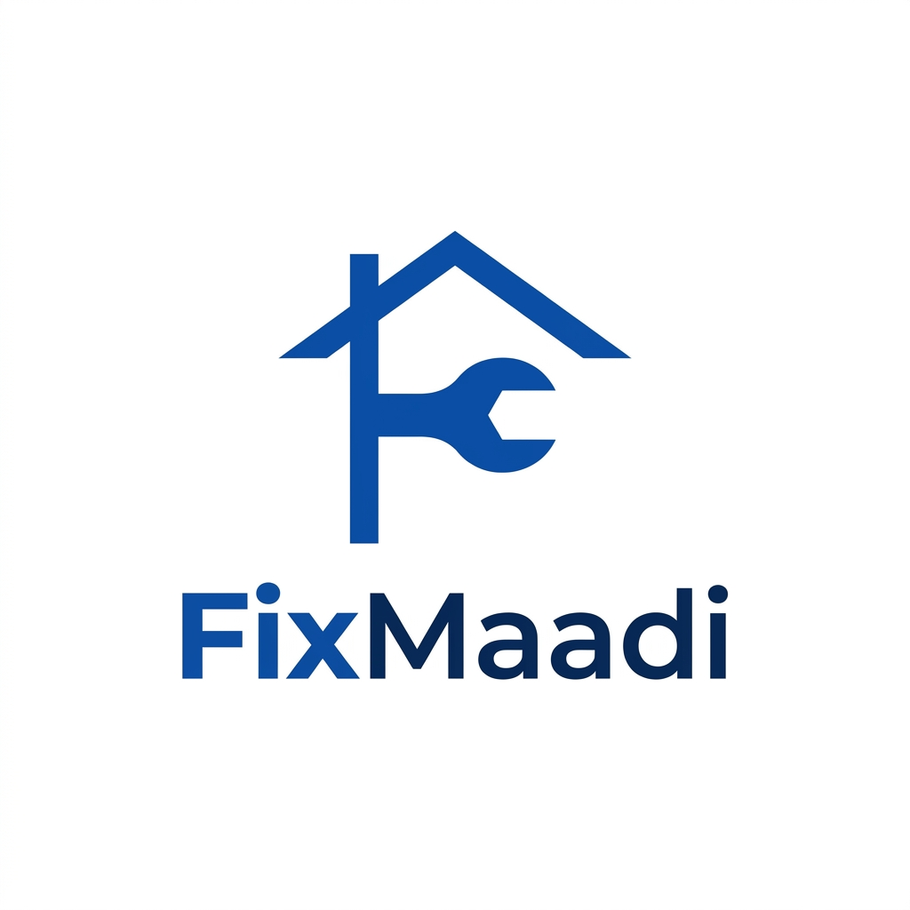

# FixMaadi Brand Identity Kit

FixMaadi enforces a **Single Master Logo Policy**. We use **one official brand mark** across all touchpoints (light mode, dark backgrounds, social media profile pictures, auto-rickshaw stickers, and printables) to build instant recognition and trust in Bagalkot.

---

## 🖼️ Master Logo

### Design Metaphor & Symbolism
* **The Roof Line (🏠)** — safety, home shelter, and peace of mind.
* **The Precision Wrench (🔧)** — craftsmanship, skilled labor, and local problem-solving.
* **Monogram 'F'** — clean, modern typography representing **FixMaadi** ("Maadi" = "Do it" in Kannada).
* **Color** — Sapphire Trust Blue on crisp clean background.

## Logo Variants (all included in this repository, all downloadable)

| File | Use |
|---|---|
| `fixmaadi_official_logo.jpg` | Default — WhatsApp DP, web header, general use |
| `fixmaadi_logo_light_1786549092449.jpg` | Light backgrounds |
| `fixmaadi_logo_dark_1786549114784.jpg` | Dark backgrounds |
| `fixmaadi_social_dp_1786549137508.jpg` | Instagram/social profile picture (pre-cropped square) |
| `fixmaadi_minimal_poster_1786547765168.jpg` | Print/poster minimal mark |

All files are `.jpg` — opens natively on Mac (Preview), Windows (Photos), iPhone, and Android with no special software.

### Logo Don'ts
- Don't recolor the mark outside the approved palette below.
- Don't stretch or skew — always scale proportionally.
- Don't place on a background with insufficient contrast (test against Sapphire Trust Blue and Canvas White first).
- Don't crop the roof line or wrench elements out of the mark.

---

## 🎨 Official Color Specifications

| Color | HEX | RGB | CMYK | Purpose |
| :--- | :--- | :--- | :--- | :--- |
| **Sapphire Trust Blue** | `#0F52BA` | `15, 82, 186` | `92, 56, 0, 27` | Master logo mark, primary buttons, links |
| **Midnight Navy** | `#0A192F` | `10, 25, 47` | `79, 47, 0, 82` | Headlines, dark UI elements |
| **Canvas White** | `#FFFFFF` | `255, 255, 255` | `0, 0, 0, 0` | Background, clean space |
| **Success Green** | `#10B981` | `16, 185, 129` | `91, 0, 30, 27` | Completed states, positive confirmations |
| **Alert Amber** | `#F59E0B` | `245, 158, 11` | `0, 36, 96, 4` | Ratings/stars, in-progress states |

## Typography

- **Primary (Latin script):** system UI sans-serif stack (`-apple-system, Segoe UI, Roboto, Arial, sans-serif`) — matches the dashboard, no font licensing to manage, renders correctly on every device without a webfont download.
- **Kannada script:** the platform's default Kannada-capable system font (Noto Sans Kannada is the safe fallback if a custom install is ever needed).
- **Headline weight:** 700 (bold). **Body weight:** 400-600.

## Voice & Tone

- **Warm, direct, respectful** — FixMaadi speaks to Bagalkot residents like a trusted neighbor, not a corporate call center.
- **Bilingual by default** — Kannada first for local trust, English available, never English-only for customer-facing copy.
- **Transparent about pricing** — always state the 0% commission model and any charges (like the ₹49 visit fee) plainly, never hide fees in fine print.
- **Short sentences in WhatsApp messages** — customers are reading on a phone, mid-task. Get to the point.

## Applications

1. **WhatsApp & social profile picture** — `fixmaadi_official_logo.jpg` or `fixmaadi_social_dp_...jpg`, centered in the platform's standard circular avatar frame.
2. **Web / Admin Dashboard header** — integrated into the dashboard's top navigation.
3. **Auto-rickshaw vinyl stickers & kirana posters** — 24" x 8" vinyl banner, Sapphire Blue logo + Kannada text, using `fixmaadi_minimal_poster_...jpg` as the print-ready base.
